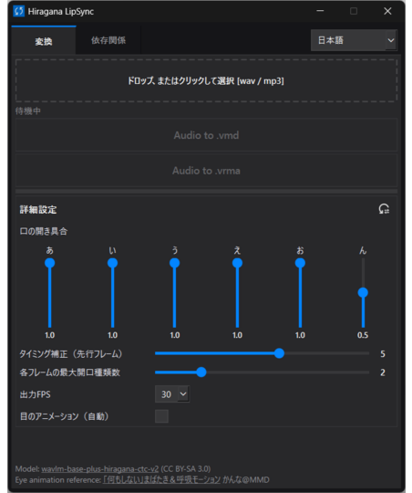

# Hiragana LipSync

[English](README.md) | [日本語](README_ja.md) | [中文](README_zh.md)

Hiragana LipSync is a Windows desktop application that analyses Japanese speech and generates lip-sync animation files for MMD and VRM workflows. It accepts WAV or MP3 audio, detects Japanese phonemes with an ONNX model, and converts them into mouth-shape keyframes.



## Features

- Exports MMD Vocaloid Motion Data (`.vmd`) and VRM Animation (`.vrma`)
- Generates A / I / U / E / O / N mouth shapes
- Accepts WAV and MP3 audio by drag-and-drop or file selection
- Adjustable mouth openness for each shape
- Timing offset from -30 to +30 frames
- One to six simultaneous mouth shapes per frame
- Selectable output rate: 10, 15, or 30 FPS
- Optional automatic eye animation
- Japanese, English, and Chinese interface
- CPU inference through ONNX Runtime

## Requirements

- Windows
- The distributed Hiragana LipSync release

Python does not need to be installed separately.
## Start the application

Double-click `HiraganaLipSync.exe`.

Alternatively, run:

```powershell
.\HiraganaLipSync.exe
```

The application opens with two tabs:

- **Convert** — select audio, adjust animation settings, and export a motion file.
- **Dependencies** — inspect, install, or uninstall the processing packages used by the executable.
## Dependency installation

The Dependencies tab manages these exact versions:

| Package | Version | Purpose |
| --- | ---: | --- |
| NumPy | 2.2.6 | Audio and keyframe arrays |
| SciPy | 1.16.3 | Audio resampling |
| PyAV | 16.0.1 | MP3 decoding |
| ONNX Runtime | 1.24.4 | Phoneme-model inference |

### Included-runtime command alternative

Use these commands instead of the buttons in the Dependencies tab:

```powershell
.\python\python.exe -m pip install --no-warn-script-location numpy==2.2.6 scipy==1.16.3 av==16.0.1 onnxruntime==1.24.4
```

To uninstall the same dependencies:

```powershell
.\python\python.exe -m pip uninstall -y numpy scipy av onnxruntime
```

These commands modify only the runtime used by the executable. They do not remove the application or generated motion files.
## Usage

1. Start the application.
2. Open the **Dependencies** tab and install any missing processing packages.
3. Return to **Convert**.
4. Drop one `.wav` or `.mp3` file onto the audio area, or click the area to select it.
5. Adjust the settings if needed.
6. Click **Audio to .vmd** or **Audio to .vrma**.
7. Wait until the status shows that conversion is complete.

The generated file is saved automatically in the current user's `Downloads` folder as:

```text
<source-name>_lipsync.vmd
<source-name>_lipsync.vrma
```

An existing file with the same name is overwritten.

## Settings

| Setting | Range / choices | Default |
| --- | --- | --- |
| Mouth openness | 0.0–1.0 for A, I, U, E, O, N | 1.0 for vowels; 0.5 for N |
| Timing offset | -30 to +30 lead frames | +5 |
| Max shape types per frame | 1–6 | 2 |
| Output FPS | 10, 15, 30 | 30 |
| Eye animation | Off / On | Off |

The reset button restores these defaults. The selected interface language is stored in `src/config.json`.

## Output compatibility

- VMD uses the morph names `あ`, `い`, `う`, `え`, `お`, and `ん`.
- VRMA uses the standard expression presets `aa`, `ih`, `ou`, `ee`, and `oh`.
- When eye animation is enabled, VMD receives eye morph/bone animation and VRMA receives a `blink` expression track.
- Audio is converted internally to mono, 16 kHz samples before inference.

## Troubleshooting

### A dependency is marked as missing

Install the pinned packages from the Dependencies tab or use the included-runtime installation command above. The tab treats a package with a different version as missing.

### MP3 cannot be opened

Confirm that `av==16.0.1` is installed. WAV input can be used without PyAV.

### The model is not found

Confirm that `model/phoneme.onnx` and `model/phoneme_tokenizer/tokenizer.json` remain under the application folder.

### No output appears beside the audio file

Output is always written to the current user's `Downloads` folder, not beside the input audio.

